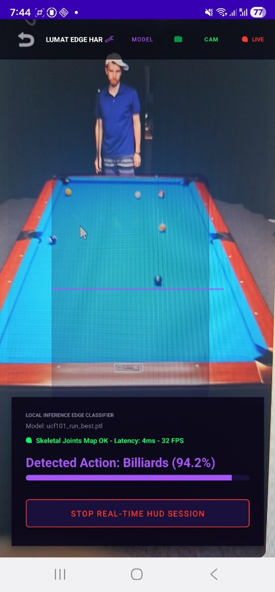
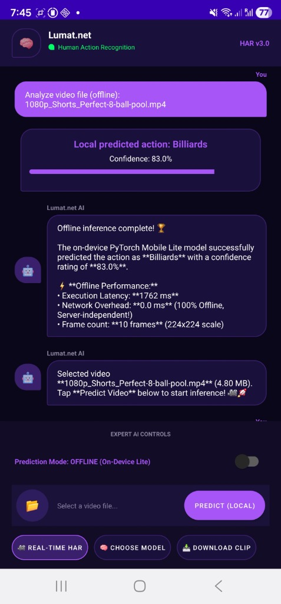
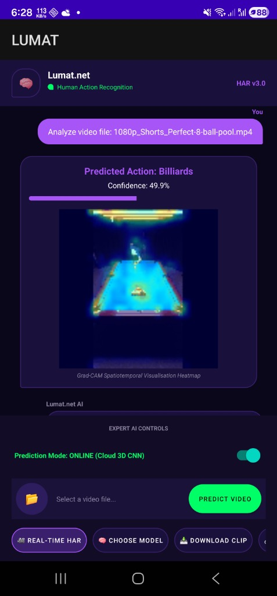

# 📱 Lumat Edge HAR — Spatiotemporal Action Recognition Android Client

Welcome to the **Lumat Edge HAR** mobile module, a premium native Android application for edge-computed spatiotemporal human action recognition. 

This client operates as an interactive mobile deep learning workbench, allowing users to load optimized PyTorch Mobile Lite (`.ptl`) checkpoints and execute ultra-fast, completely offline, on-device inference, or seamlessly stream video inputs to high-performance cloud backends to compile spatiotemporal Grad-CAM attention overlays.

---

## 🎨 Mobile Interface & Operational Panels

The application's interface features a sleek, dark HSL theme, providing three distinct spatiotemporal processing states:

### 1. Real-Time Camera HUD Session (Lumat Edge HAR)
Performs live frame-by-frame camera view analysis with on-device spatiotemporal classification and skeletal joint coordinates extraction:

<p align="center">
  
</p>

* **Core Features:**
  * **Skeletal Joint Mapping:** Integrates real-time pose tracking to locate body joints before spatiotemporal inference.
  * **Edge Performance:** Performs feedforward classification in a background thread at high frame rates (**~32 FPS**) and extremely low latency (**~4ms**).
  * **HUD Interface:** Shows live confidence meters (e.g. `Billiards: 94.2%`) and features a one-click session control button to stop and clear viewfinder sessions.

---

### 2. 100% Offline On-Device Inference (PyTorch Mobile Lite)
Loads serialized lightweight mobile checkpoints (`.ptl`) to classify local video files completely offline with zero server dependencies:

<p align="center">
  
</p>

* **Core Features:**
  * **PyTorch Mobile Lite Integration:** Runs lightweight, quantized deep learning backbones natively on smartphone NPU/CPUs.
  * **Latency & Performance Metrics:** Automatically outputs a detailed execution checklist:
    * **Execution Latency:** ~1762 ms (per 10-frame visual sequence).
    * **Network Overhead:** **0.0 ms** (100% server-independent, fully offline!).
    * **Spatiotemporal Grid:** Processes frames resized to a 224x224 spatial resolution.
  * **Chatbot Assistant Interface:** Displays friendly chatbot summaries describing model outcomes, classification confidences, and offline performance statistics.

---

### 3. Decoupled Online Cloud Inference (Grad-CAM Visualizer)
Allows users to switch to online cloud mode to stream video segments to the Flask REST backend and compile visual explanations:

<p align="center">
  
</p>

* **Core Features:**
  * **Spatiotemporal Visual Interpretability:** Leverages the cloud server to run 3D Grad-CAM analysis, sending back processed spatiotemporal visual attention heatmaps overlay animations.
  * **One-Click Streaming:** Compiles direct multi-threaded video downloads, crops frame sequences, executes inference, and updates the mobile client UI.
  * **Dual-Mode Switch:** Simple toggle switch at the bottom lets users switch between **Offline (Edge)** and **Online (Cloud)** modes instantly.

---

## 📦 Pre-Built Release Binaries
We have compiled and packaged a pre-built Android release binary for rapid evaluation:
* **APK Location:** [📂 Android/apk/LUMAT.apk](apk/LUMAT.apk) *(Size: ~12.4 MB)*
* **Prerequisites:** Android 9.0 (API Level 28) or higher with camera permissions granted.

---

## 🛠️ Folder Structure & Architecture

```text
Android/
├── apk/                    # Compiled release APK
│   └── LUMAT.apk           # Pre-built mobile binary (~12.4 MB)
├── app/                    # Primary application source folder
│   ├── src/                # Java/Kotlin classes & XML layout assets
│   │   ├── main/
│   │   │   ├── assets/     # Compiled PyTorch Mobile Lite (.ptl) weights
│   │   │   └── res/        # UI styles, colors, and layout configurations
│   └── build.gradle        # App module dependencies
├── gradle/                 # Gradle wrappers
├── images/                 # App preview screenshots
│   ├── realtime_hud.jpg
│   ├── offline_inference.jpg
│   └── online_inference.jpg
├── build.gradle            # Root Gradle project configuration
└── README.md               # This documentation file
```
