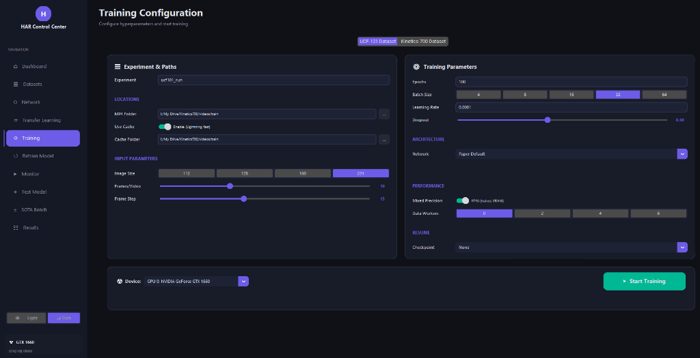
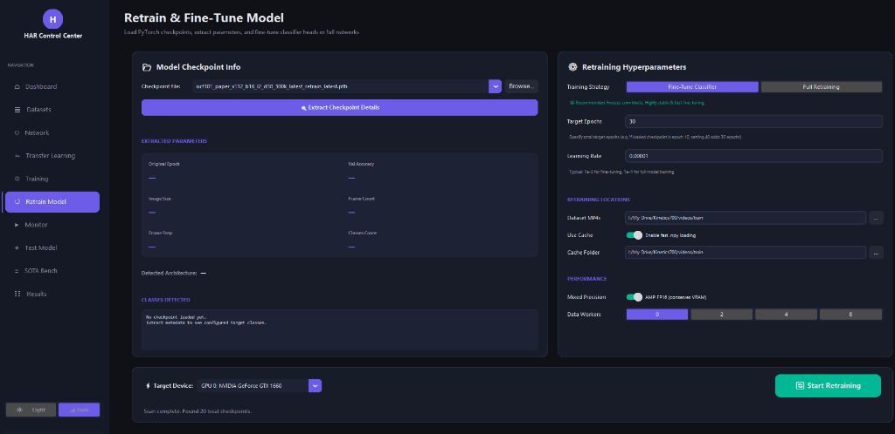
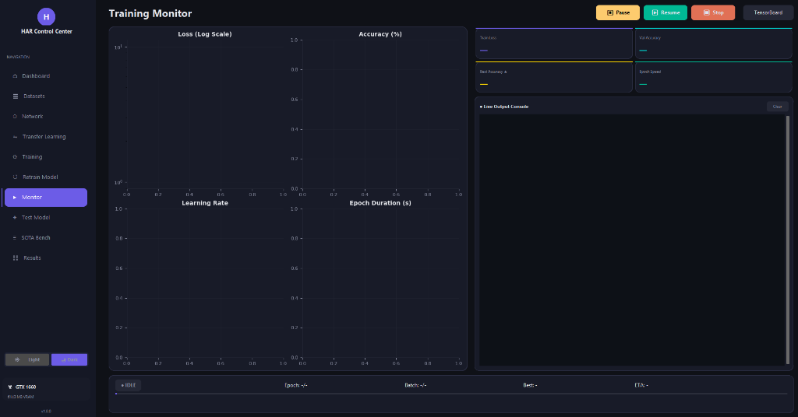

# 🖥️ HAR Control Center - Spatiotemporal Deep Learning Desktop Application

Welcome to the **HAR Control Center**, the native desktop application for visual computing and lightweight spatiotemporal learning. 

This standalone module serves as an interactive deep learning research workbench. Researchers can visually compile custom 3D neural topologies, launch stateful training runs (with live pause, resume, and retrain), track epoch curves, analyze SOTA parameter/FLOP diagnostics, and execute local video inference overlays.

---

## 🎨 Application Screenshots & Interface Guide

This native CustomTkinter workbench provides 5 advanced graphical panels, allowing researchers to fully control the deep learning lifecycle without writing a single line of code:

### 1. Unified Research Dashboard
The main dashboard displays active project status, live model metrics, precision/recall bar charts, confusion matrices, and top-performing action classes:


### 2. Network Architect (Dynamic AST Layer-Sequencing)
The **Network Architect** panel allows researchers to interactively design custom 3D neural topologies from scratch or load established defaults.


* **Instructions & Actions:**
  * **Quick Start Presets:** Click on *Paper Default*, *Lightweight*, *Deep*, or *Plain Conv3D* at the top to immediately load pre-configured neural baselines.
  * **AST Layer Management:** Use the colored button shortcuts (`+ R(2+1)D`, `+ Conv3D`, `+ Pool`, `+ BN`, `+ Drop`) to add layers dynamically in the *Architecture Flow* list.
  * **Interactive Customization:** Click on any layer block in the flow list to edit its properties (channels, kernel size, stride, padding) in the *Layer Properties* pane on the right.
  * **Ordering & Management:** Select a layer block and click `▲ Up`, `▼ Down`, `✖ Del`, or `Reset` to reorder, delete, or clear the architecture structure.
  * **Visual Summary:** Keep track of the *Output Shape* propagation and total accumulated parameter counts under the *Model Summary* pane.
  * **Export / Import:** Click `💾 Save` to serialize your custom architecture layout to disk, or `📥 Load` to retrieve past work.

### 3. Isolated Asynchronous Transfer Learning Module
The **Transfer Learning** panel is dedicated to high-performance backbone tuning and feature extraction.


* **Instructions & Actions:**
  * **1. Backbone Ingestion:** Browse and load pre-trained 3D CNN backbones (e.g., `r3d_18_kinetics.pth`). Click `Ingest & Validate Backbone` to analyze layer architecture compatibility on CPU/GPU.
  * **2. Custom Classification Head:** Select the target head architecture (e.g., *Paper Default*) to automatically bind the final classifier layer for UCF-101 (101 classes) or Kinetics-700.
  * **3. Datasets & Space Optimizations:** Toggle `Use Lathe` to utilize compressed numpy vectors for accelerated I/O. Set your custom *Cache Folder* and *Raw Videos Path*.
  * **4. Hyperparameter Settings:** Customize training options (Optimizer, Learning Rate, scheduler, target epochs, batch size, and Mixed Precision/AMP toggle to save VRAM).
  * **5. Interactive Controls:** Click `▶ Train` to initiate the training loop, `⏸ Pause` to pause execution, `▶ Resume` to pick up where you left off, and `↺ Retrain` to reset and clear the training cache. Track metrics on the **Live Analytics Graph** canvas!

### 4. State-of-the-Art Training Configuration
The **Training** panel lets you configure full training parameters for training new networks from scratch.



* **Instructions & Actions:**
  * **Dataset Target Selection:** Toggle between the *UCF-101 Dataset* and *Kinetics-700 Dataset* tabs at the top to load dataset-specific setups.
  * **Experiment & Paths:** Specify the experiment name (e.g., `ucf101_run`), video MP4 folders, and set whether to utilize lightning-fast cached inputs.
  * **Spatiotemporal Parameters:** Customize visual constraints: *Image Size* (112, 128, 160, or 224), *Frames per Video* (depth), and *Frame Step* (temporal stride).
  * **Hyperparameter & Optimization Panel:** Adjust training epochs, batch size, learning rate, and dropout probability. Select from advanced options: *Mixed Precision (FP16)* for memory savings, and allocate CPU *Data Workers* (0, 2, 4, 8) for parallel asynchronous loading.
  * **Execution:** Choose your hardware target in the *Device* dropdown (e.g., `GPU 0: NVIDIA GeForce GTX 1660`) and hit `▶ Start Training` to deploy.

### 5. Interactive Retraining & Fine-Tuning
The **Retrain Model** panel enables loading existing checkpoints, inspecting their metadata, and carrying out focused fine-tuning or full-network retraining.



* **Instructions & Actions:**
  * **Model Checkpoint Info:** Click `Browse...` or select a PyTorch checkpoint file (`.pth`) from the local directories.
  * **Checkpoint Analysis:** Click `Extract Checkpoint Details` to parse and show the model metadata (original trained epochs, validation accuracy, spatial image size, clip frame length, temporal step, and class counts).
  * **Fine-Tuning Strategy:** Toggle between *Fine-Tune Classifier* (freezes the spatiotemporal feature backbone to train only the classification head, which is highly stable and fast) and *Full Retraining* (unfreezes all layers for comprehensive end-to-end backpropagation).
  * **Hyperparameters & Paths:** Customize retraining epochs, learning rates, data caching, and Mixed Precision toggles. Select CPU workers for the dataloader.
  * **Execution:** Verify the target *Device* (CPU/GPU) and click `▶ Start Retraining` to begin.

### 6. Training Monitor & Live Console
The **Monitor** panel is a dashboard that showcases live spatiotemporal training statistics.



* **Instructions & Actions:**
  * **Live Loss (Log Scale):** Graphing epoch loss dynamically on a logarithmic scale to visually capture training divergence or fine convergence.
  * **Live Accuracy (%):** Displays real-time training and validation accuracy progression.
  * **Learning Rate & Duration Curves:** Tracks optimizer step rates and epoch speeds (seconds per epoch) to detect server performance or scheduler stepping.
  * **Execution Controls:** Control the training process directly with `⏸ Pause`, `▶ Resume`, and `🛑 Stop` buttons at the top.
  * **Interactive Console & Logs:** Read detailed traceback logs, batch speed stats, and evaluation matrices inside the scrollable *Live Output Console*. Click the **TensorBoard** shortcut to spawn a local TensorBoard tracking instance!

---

## 🚀 One-Click Quick Start (Auto-Setup)

We have included automated launchers that handle Python virtual environment initialization, `pip` upgrades, and library installation in **one click**:

### Windows 💻
Simply double-click:
```bash
run_gui.bat
```
*(This will check for Python, spin up a local `env/` virtual environment, install CustomTkinter/PyTorch dependencies from the requirements file, and launch the application.)*

### Linux & macOS 🐧 🍎
Open a terminal in this directory and execute:
```bash
chmod +x run_gui.sh
./run_gui.sh
```

---

## ⚡ NVIDIA CUDA GPU Acceleration Guide

While the application gracefully runs on the CPU, utilizing a dedicated NVIDIA graphics card activates **10x to 50x faster training and inference** via CUDA and mixed-precision (FP16) tensor core optimizations.

Follow these simple steps to configure GPU acceleration:

1. **Install NVIDIA Graphics Drivers:** Ensure your workstation has the latest official NVIDIA drivers installed.
2. **Download & Install the NVIDIA CUDA Toolkit:**
   * Visit the official website: [NVIDIA CUDA Downloads](https://developer.nvidia.com/cuda-downloads)
   * Select your OS (e.g., Windows 11 / Linux x86_64) and download the **CUDA Toolkit (v11.8 or v12.1+ recommended)**.
   * Run the installer and complete the default installation.
3. **Install CUDA-Accelerated PyTorch:**
   Our launcher scripts install standard CPU-based PyTorch by default to guarantee compatibility. To enable GPU acceleration inside the virtual environment:
   * Activate the virtual environment manually:
     ```bash
     # Windows
     env\Scripts\activate
     # Linux/macOS
     source env/bin/activate
     ```
   * Uninstall the CPU package and install the CUDA wheel from the official PyTorch indices:
     ```bash
     pip uninstall -y torch torchvision
     # For CUDA 11.8:
     pip install torch torchvision --index-url https://download.pytorch.org/whl/cu118
     # For CUDA 12.1:
     pip install torch torchvision --index-url https://download.pytorch.org/whl/cu121
     ```
4. **Launch & Verify:** Launch the application (`gui.py` or through the runner scripts). The training monitor and benchmark panels will automatically display **GPU Enabled** alongside your graphics card model name!

---

## 📂 Desktop App Structure

```text
Desktop-App/
├── gui/                      # GUI module code (frames, services, sidebar styling)
├── har/                      # Core deep learning PyTorch package (models, datasets, evaluators)
├── images/                   # Illustrated screenshots for user documentation
├── results/                  # Stateful experimental assets folder
│   ├── checkpoints/          # Preloaded model weights
│   │   ├── ucf101_paper_x112_b16_l2_d30_300k_best.pth  # R(2+1)D-Light (300K, ~3.53 MB)
│   │   ├── ucf101_3dcnn_best.pth                       # Plain 3D CNN (292K, ~3.52 MB)
│   │   └── r3d_18_kinetics_best.pth                    # Pretrained R3D-18 Backbone (~127 MB)
│   ├── metrics/              # Pinned class accuracy and JSON metrics reports
│   └── tensorboard/          # Saved training event logs for baselines
├── Sample-Test/              # Folder to drop video clips for local testing
├── gui.py                    # Main app runner entrypoint
├── gui_settings.json         # Window placement and theme configurations
├── run_gui.bat               # Windows one-click auto-setup script
└── run_gui.sh                # Linux/macOS one-click auto-setup script
```

---

## 🎬 Testing Local Video Files

1. Place any video file (`.mp4`, `.avi`, or `.mov`) inside the empty **`Sample-Test/`** folder.
2. Launch the application.
3. Navigate to the **Model Tester** frame on the sidebar.
4. Select one of the preloaded models (e.g., `R(2+1)D-Light 300k`).
5. Choose your video clip from the dropdown list.
6. Click **Run Model Inference** to classify the human action and generate real-time spatiotemporal Grad-CAM heatmap overlays!
