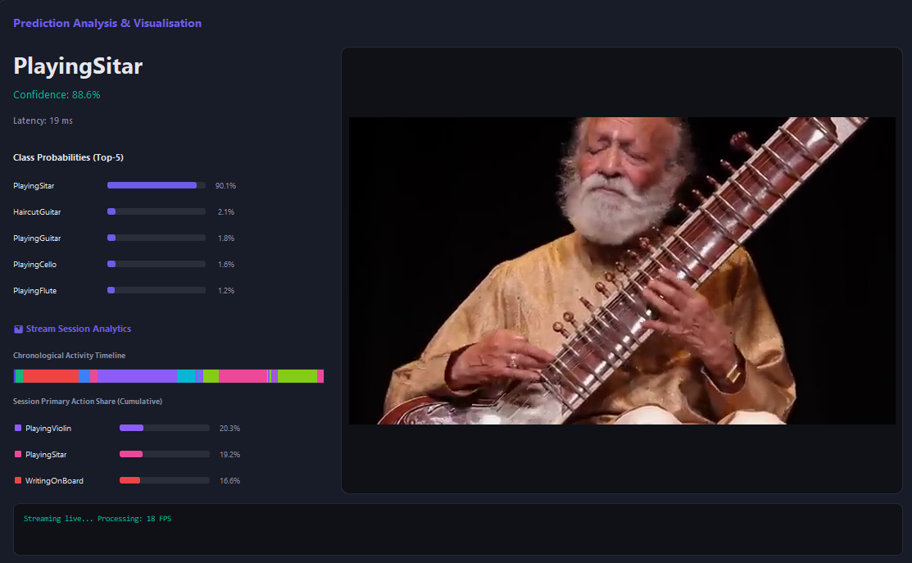

# 🖥️ HAR Control Center - Spatiotemporal Deep Learning Desktop Application

Welcome to the **HAR Control Center**, the native desktop application for visual computing and lightweight spatiotemporal learning. 

This standalone module serves as an interactive deep learning research workbench. Researchers can visually compile custom 3D neural topologies, launch stateful training runs (with live pause, resume, and retrain), track epoch curves, analyze SOTA parameter/FLOP diagnostics, and execute local video inference overlays.

---

## 🎨 Application Screenshots

### 1. Unified Research Dashboard
The main dashboard displays active project status, live model metrics, precision/recall bar charts, confusion matrices, and top-performing action classes:


### 2. Interactive Network Architect
The network architect panel allows researchers to drag-and-drop or sequence layers (2D, 3D, and factorised (2+1)D residual blocks) and visually inspect parameter counts and shape propagation:



---

## 🚀 One-Click Quick Start (Auto-Setup)

We have included automated launchers that handle Python virtual environment initialization, `pip` upgrades, and library installation in **one click**:

### Windows 💻
Simply double-click:
```bash
run_gui.bat
```
*(This will check for Python, spin up a local `env/` virtual environment, install CustomTkinter/PyTorch dependencies from the requirements file, and launch the application.)*

### Linux & macOS 🐧 🍎
Open a terminal in this directory and execute:
```bash
chmod +x run_gui.sh
./run_gui.sh
```

---

## ⚡ NVIDIA CUDA GPU Acceleration Guide

While the application gracefully runs on the CPU, utilizing a dedicated NVIDIA graphics card activates **10x to 50x faster training and inference** via CUDA and mixed-precision (FP16) tensor core optimizations.

Follow these simple steps to configure GPU acceleration:

1. **Install NVIDIA Graphics Drivers:** Ensure your workstation has the latest official NVIDIA drivers installed.
2. **Download & Install the NVIDIA CUDA Toolkit:**
   * Visit the official website: [NVIDIA CUDA Downloads](https://developer.nvidia.com/cuda-downloads)
   * Select your OS (e.g., Windows 11 / Linux x86_64) and download the **CUDA Toolkit (v11.8 or v12.1+ recommended)**.
   * Run the installer and complete the default installation.
3. **Install CUDA-Accelerated PyTorch:**
   Our launcher scripts install standard CPU-based PyTorch by default to guarantee compatibility. To enable GPU acceleration inside the virtual environment:
   * Activate the virtual environment manually:
     ```bash
     # Windows
     env\Scripts\activate
     # Linux/macOS
     source env/bin/activate
     ```
   * Uninstall the CPU package and install the CUDA wheel from the official PyTorch indices:
     ```bash
     pip uninstall -y torch torchvision
     # For CUDA 11.8:
     pip install torch torchvision --index-url https://download.pytorch.org/whl/cu118
     # For CUDA 12.1:
     pip install torch torchvision --index-url https://download.pytorch.org/whl/cu121
     ```
4. **Launch & Verify:** Launch the application (`gui.py` or through the runner scripts). The training monitor and benchmark panels will automatically display **GPU Enabled** alongside your graphics card model name!

---

## 📂 Desktop App Structure

```text
Desktop-App/
├── gui/                      # GUI module code (frames, services, sidebar styling)
├── har/                      # Core deep learning PyTorch package (models, datasets, evaluators)
├── images/                   # Illustrated screenshots for user documentation
├── results/                  # Stateful experimental assets folder
│   ├── checkpoints/          # Preloaded model weights
│   │   ├── ucf101_paper_x112_b16_l2_d30_300k_best.pth  # R(2+1)D-Light (300K, ~3.53 MB)
│   │   ├── ucf101_3dcnn_best.pth                       # Plain 3D CNN (292K, ~3.52 MB)
│   │   └── r3d_18_kinetics_best.pth                    # Pretrained R3D-18 Backbone (~127 MB)
│   ├── metrics/              # Pinned class accuracy and JSON metrics reports
│   └── tensorboard/          # Saved training event logs for baselines
├── Sample-Test/              # Folder to drop video clips for local testing
├── gui.py                    # Main app runner entrypoint
├── gui_settings.json         # Window placement and theme configurations
├── run_gui.bat               # Windows one-click auto-setup script
└── run_gui.sh                # Linux/macOS one-click auto-setup script
```

---

## 🎬 Testing Local Video Files

1. Place any video file (`.mp4`, `.avi`, or `.mov`) inside the empty **`Sample-Test/`** folder.
2. Launch the application.
3. Navigate to the **Model Tester** frame on the sidebar.
4. Select one of the preloaded models (e.g., `R(2+1)D-Light 300k`).
5. Choose your video clip from the dropdown list.
6. Click **Run Model Inference** to classify the human action and generate real-time spatiotemporal Grad-CAM heatmap overlays!
