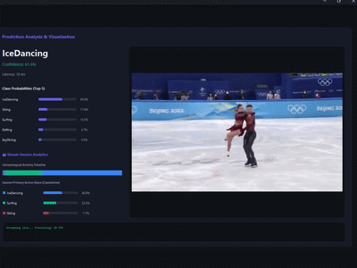
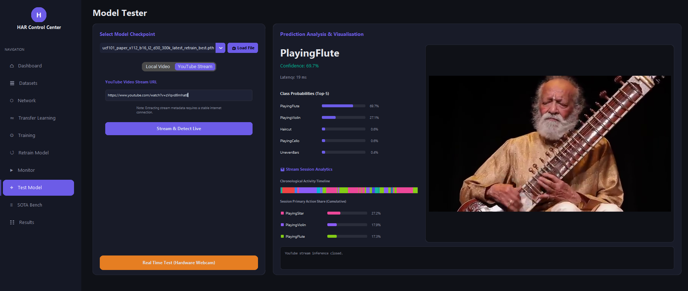
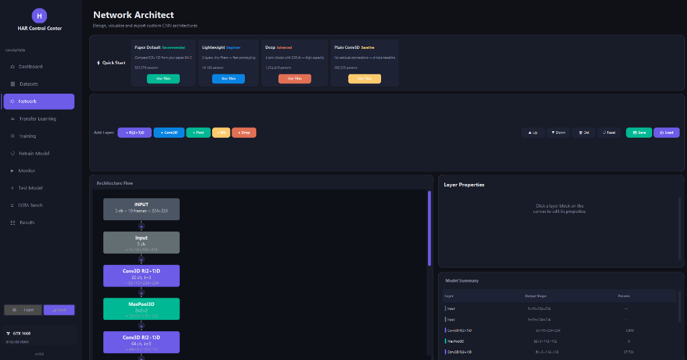
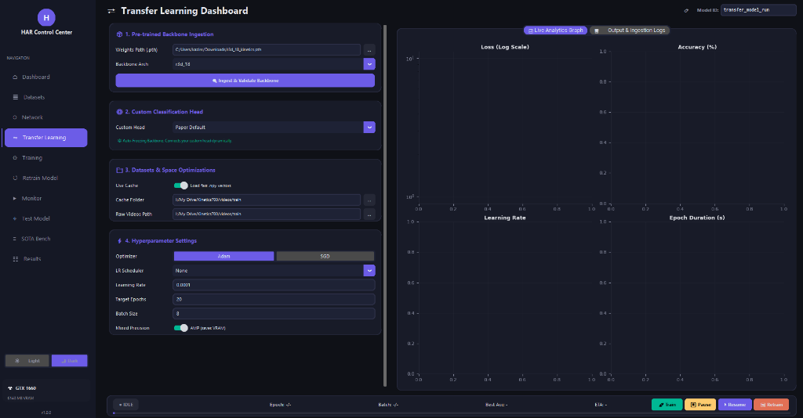
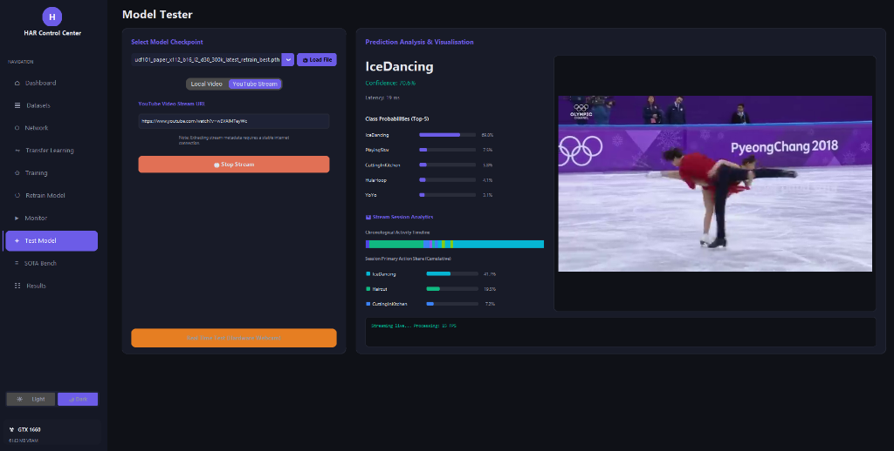

# End-to-End Lightweight Spatiotemporal Learning for Practical Human Action Classification

<div align="center">

[](https://link.springer.com/)
[](https://doi.org/10.5281/zenodo.20375718)
[](https://opensource.org/licenses/MIT)
[](https://www.python.org/downloads/)
[](https://pytorch.org/)

**Official open-source repository for the paper "End-to-End Lightweight Spatiotemporal Learning for Practical Human Action Classification" revised and resubmitted to The Visual Computer (Springer Nature).**

This repository provides a unified visual computing framework spanning cloud APIs, mobile edge devices, interactive desktop training gates, and cloud notebook clusters.

<br>



<br>

<a href="#quickstart">
  
</a>

</div>

---

## 📑 Table of Contents
- [The Four-Folder Repository Architecture](#four-folder)
- [Codebase Directory Layout](#directory-layout)
- [Application Screenshots & Interface Guide](#screenshots)
- [System Requirements & Prerequisites](#requirements)
- [Global Environment Quickstart](#quickstart)
- [Dataset Ingestion & Official Downloads](#dataset-ingestion)
- [Model Training & Testing Guide](#training-testing)
- [Real-Time YouTube Video Inference](#youtube-inference)
- [How to Register a Permanent Zenodo DOI](#zenodo-doi)
- [Citation](#citation)

---

<a id="four-folder"></a>
## 🚀 The Four-Folder Repository Architecture

To ensure structured navigation for researchers, developers, and peer-reviewers, this repository is organized into exactly **four primary folders**:

### 1. [📂 Desktop-App](./Desktop-App)
The local research workstation module containing the Tkinter-based interactive GUI app (`HAR Control Center`).
* **Visual Graph Builder:** Construct custom convolutional network layers and trace dimensions.
* **Stateful Monitor:** Training loop supervisor featuring live pause, resume, and history-safe retraining.
* **Baseline Suite:** Preloaded with model weights discussed in the paper:
  1. `R(2+1)D-Light 300k` (303,576 parameters, 82.06% accuracy on UCF101)
  2. `Plain 3D CNN 292k` (292,325 parameters baseline)
  3. `R3D-18 Backbone` *(Note: Exceeds GitHub's 100MB limit. [Download the ~127MB weights from Google Drive](https://drive.google.com/drive/folders/1trLn6IUbMo0bZHRBSFoyu0O-hYnzXK3o?usp=sharing))*
* **Logs & Metrics:** Complete TensorBoard run event logs and accuracy metrics reports.
* **Auto-Launchers:** One-click double-click scripts (`run_gui.bat` / `run_gui.sh`) that set up virtual environments and install libraries.

### 2. [📂 Web-api](./Web-api)
The production Gunicorn/Flask cloud REST API and interactive web dashboard.
* **Decoupled Stream Processing:** Multi-threaded query queue, uniform frame segment normalization, and high-speed Grad-CAM attention visualizers.
* **Subdomain Cleanup:** Configured out-of-the-box to run on `http://localhost:5000/` for local testing.
* **Mobile Compilation Weight Assets:** Includes the PyTorch Mobile Lite (`.ptl`) offline weight checkpoints so mobile clients can download them on-device.

### 3. [📂 Android](./Android)
The native Gradle-based Android Studio mobile edge client.
* **Illustrated Documentation:** See the [detailed Android user guide and screenshots](./Android/README.md) for a complete visual breakdown.
* **Camera Overlay HUD:** Operates a real-time camera stream overlay HUD processing sub-20ms frame classification queries.
* **Conversational Helper:** Chat UI interface integrating action predictions into help assistance dialogs.
* **Compiled Package:** Includes `apk/LUMAT.apk` ready for direct mobile installation.


### 4. [📂 Google-Colab](./Google-Colab)
Polished Jupyter Notebook training pipelines pre-configured to run on cloud T4 GPUs:
* `UCF101_HAR_Pipeline.ipynb`: UCF101 uniform segment download, pre-processing, training, and Grad-CAM exporting.
* `Kinetics700_HAR_Pipeline.ipynb`: Decoupled asynchronous segmented downsampling manager to train on the Kinetics dataset.

---

<a id="directory-layout"></a>
## 📂 Codebase Directory Layout

```text
.
├── Android/                    # Native Android Studio project (Java)
├── Desktop-App/                # Standalone Desktop GUI Control Center
│   ├── gui/                    # Sidebar layout frames and background thread services
│   ├── har/                    # Core deep learning Torch package (config, models, loaders)
│   ├── results/                # Checkpoints, metrics & curves
│   │   ├── checkpoints/        # Note: 127MB R3D-18 Kinetics model is hosted on Google Drive
│   ├── Sample-Test/            # Folder to drop video clips for local GUI testing
│   ├── images/                 # User guide illustrated screenshots
│   ├── run_gui.bat             # Windows one-click auto-setup batch script
│   └── run_gui.sh              # Linux/macOS one-click auto-setup bash script
├── Google-Colab/               # Cloud GPU training Jupyter notebooks (.ipynb)
├── Web-api/                    # Localhost-configured Flask REST API server
├── CITATION.cff                # Standard citation file
└── .gitignore                  # Git repository exclusion settings
```

---

<a id="screenshots"></a>
## 🎨 Application Screenshots & Interface Guide

Our **HAR Control Center** (Desktop-App) provides an interactive deep learning research workbench. Here is a glimpse of the powerful visual features you can use without writing any code:

| Research Dashboard | Network Architect |
| :---: | :---: |
|  |  |
| Real-time project status, metrics, and precision/recall charts. | Visually compile custom 3D neural topologies from scratch. |

| Transfer Learning | Model Tester |
| :---: | :---: |
|  |  |
| Fine-tune backbones with stateful control and live loss graphs. | Test local videos or YouTube streams with live Grad-CAM analysis. |

*For more detailed feature breakdowns and all 8 graphical panels, please read the [Desktop-App README](./Desktop-App/README.md).*

---

<a id="requirements"></a>
## 📋 System Requirements & Prerequisites

Before running the application, make sure your system satisfies the following hardware and software specifications:

### 1. Operating System Compatibility
* **Windows**: Windows 10 or 11 (64-bit)
* **Linux**: Ubuntu 20.04 LTS, 22.04 LTS, or newer derivatives
* **macOS**: macOS 11 Big Sur or newer (supports Intel and Apple Silicon)

### 2. Python Environment (Mandatory)
The application requires **Python 3.9, 3.10, or 3.11** (Python 3.10/3.11 recommended).
* **Download:** [Official Python Downloads](https://www.python.org/downloads/)
* **Windows Tip:** Make sure to check **"Add Python.exe to PATH"** during installation.

### 3. Hardware Requirements
* **Memory (RAM):** 8 GB minimum (16 GB recommended).
* **Storage Space:** 500 MB for app files, +2 GB for datasets/checkpoints.
* **CPU:** Multicore Intel/AMD x86_64 or Apple M-series (AVX2 supported).
* **GPU (Recommended):** NVIDIA GPU with Tensor Cores (4GB+ VRAM). CUDA toolkit and GPU-enabled PyTorch highly recommended for mixed-precision (FP16) speedups.

---

<a id="quickstart"></a>
## ⚙️ Global Environment Quickstart

You can easily set up the project locally. 

```bash
# 1. Clone the repository
git clone https://github.com/IstiyakV/End-to-End-Lightweight-Spatiotemporal-Learning-for-Practical-Human-Action-Classification.git
cd End-to-End-Lightweight-Spatiotemporal-Learning-for-Practical-Human-Action-Classification

# 2. Enter the Desktop-App directory
cd Desktop-App
```

**For Windows Users:**
Simply double-click the `run_gui.bat` file! It will automatically create a virtual environment (`env`), install all PyTorch and GUI dependencies, and launch the application.

**For Linux/macOS Users:**
```bash
chmod +x run_gui.sh
./run_gui.sh
```

**Alternative Manual Loading:**
If you prefer to bypass the one-click scripts and configure the environment manually:

1. **Create the virtual environment:**
   ```bash
   python -m venv env
   ```
2. **Activate the environment:**
   * **Windows:**
     ```cmd
     call env\Scripts\activate
     ```
   * **Linux/macOS:**
     ```bash
     source env/bin/activate
     ```
3. **Install dependencies and launch:**
   ```bash
   pip install -r requirements.txt
   python gui.py
   ```

---

<a id="dataset-ingestion"></a>
## 📊 Dataset Ingestion & Official Downloads

To train or evaluate our compact models, download the official spatiotemporal video benchmarks from the following verified archives:

* **UCF101 Dataset:**
  * **Official Portal:** [UCF101 Action Recognition](https://www.crcv.ucf.edu/data/UCF101.php)
  * **Direct Dataset Download:** [UCF101.rar (~6.5 GB)](https://www.crcv.ucf.edu/data/UCF101/UCF101.rar)
  * **Direct Class Annotations:** [UCF101 Train/Test Splits](https://www.crcv.ucf.edu/data/UCF101/UCF101TrainTestSplits-RecognitionTask.zip)
* **Kinetics-700 Dataset:**
  * **Official Portal:** [Kinetics Dataset on DeepMind](https://github.com/google-deepmind/kinetics-dataset)
  * **Consolidated Hugging Face Host:** [Kinetics-700 HF Dataset Archive](https://huggingface.co/datasets/atalaydenknalbant/Kinetics-700)
  
> 💡 **Recommended Tool: Standalone Kinetics-700 Downloader GUI**
> To fully automate the complex pipeline of downloading and decompressing the massive 960GB Kinetics-700 dataset, we have open-sourced a companion tool: the [Kinetics-700 Dataset Downloader & Manager](https://github.com/IstiyakV/Kinetics-700-Dataset-Downloader-and-Manager). This interactive desktop application utilizes Temporal Segment Networks (TSN) frame-sampling logic to aggressively shrink the dataset footprint from **960GB down to an optimized 20GB on-the-fly**, making the dataset perfectly scalable for standard workstation SSDs.

---

<a id="training-testing"></a>
## 🏋️ Interactive GUI Training & Testing Guide

The **HAR Control Center** provides a complete, interactive, and code-free environment to design, train, monitor, and test compact spatiotemporal deep learning models.

### 1. Interactive 3D Model Designing & Compilation
1. Launch the application by double-clicking **`run_gui.bat`** (or executing `./run_gui.sh` on Linux/macOS).
2. Navigate to the **Network Architect** tab on the left sidebar.
3. Select an established baseline preset (e.g., **Paper Default (R(2+1)D)** or **Lightweight**) or dynamically construct custom 3D convolutions by clicking the layer injection buttons (`+ R(2+1)D`, `+ Conv3D`, `+ BN`, `+ Pool`).
4. Customize parameters (channels, kernel size, stride, padding) directly by clicking layer blocks.
5. Click **💾 Save** to serialize your custom architecture flow block.

### 2. Launching Stateful Model Training
1. Navigate to the **Training Configuration** tab on the sidebar.
2. Select your target training dataset split (**UCF-101 Dataset** or **Kinetics-700 Dataset**).
3. Specify the directory paths containing the raw video clips.
4. Customize spatiotemporal vision constraints (e.g., *Image Size: 112*, *Frames per Clip: 16*, and *Frame Step: 2*).
5. Configure training hyperparameters: epoch count, batch size, learning rate, dropout, and number of parallel CPU *Data Workers*.
6. Enable **Mixed Precision (FP16)** to optimize GPU VRAM, select your hardware target (e.g. `GPU 0`), and click **▶ Start Training**.
   
> ⚠️ **Stateful Control Tip:** After clicking **▶ Start Training**, if you notice that the training execution doesn't start immediately or there is no batch progress displaying in the live console log, simply navigate to the **Training Monitor** tab and click the **▶ Resume** button to trigger the active PyTorch training loop thread.


### 3. Monitoring Training Metrics in Real-Time
1. Navigate to the **Training Monitor & Live Console** tab.
2. The panel renders interactive Matplotlib canvas graphs tracking:
   - **Log-Scale Epoch Loss** (detects early convergence or divergence).
   - **Training & Validation Accuracy (%)** (monitors overfitting).
   - **Learning Rate Decays & Epoch Processing Duration (seconds/epoch)**.
3. Read active stdout training/validation log outputs in the scrollable console, or click **TensorBoard** to spawn local TensorBoard instances.
4. Utilize direct interactive widgets: **⏸ Pause**, **▶ Resume**, or **🛑 Stop** to control the active PyTorch thread on-the-fly.

### 4. Running Real-Time Inference & Spatiotemporal Visualizations
1. Navigate to the **Model Tester** tab.
2. Click **📥 Load File** or select your trained model checkpoint from the drop-down menu (e.g., `R(2+1)D-Light 300k`).
3. Select your inference mode:
   - **Local Video:** Drop video files in the `Sample-Test/` folder, select your file from the drop-down, check **Generate Grad-CAM**, and click **Run Local Prediction**.
   - **YouTube Stream:** Paste a streaming video link or click one of the **💡 Test Suggestions** to load it, and click **Stream & Detect Live**.
4. The system loads the model weights and displays:
   - **Top-5 Class Probabilities** via graphical confidence level meters (e.g., `IceDancing: 92.4%`).
   - **Activity Timeline Canvas** mapping chronological action transitions across long video clips.
   - **Real-Time Spatiotemporal Grad-CAM Visualizations** overlaying high-attention motion heatmaps.

---


<a id="youtube-inference"></a>
## 📺 Real-Time YouTube Video Inference (Desktop App)

The **HAR Control Center** allows you to perform serverless, high-speed spatiotemporal inference on live YouTube streaming clips. The application processes streams on-the-fly by parsing metadata without downloading raw video files to your local storage.

### Step-by-Step YouTube Streaming Tutorial:

1. **Launch the Application:** Double-click **`run_gui.bat`** (or execute `./run_gui.sh` on Linux/macOS) to spin up the local virtual environment and launch the Control Center.
2. **Open the Model Tester Frame:** Click the **Model Tester** tab on the left sidebar.
3. **Switch to YouTube Stream Mode:** Click the **YouTube Stream** tab at the top of the testing panel.
4. **Load or Paste a Stream URL:**
   - Paste any public YouTube link into the **YouTube Video Stream URL** input text bar (e.g. `https://www.youtube.com/watch?v=xxxx`).
   - Alternatively, you can click on any of the **💡 Test Suggestions** (Clip 1 to Clip 8) in the grid at the bottom. This will automatically load the verified URL into the entry box and copy it to your clipboard for quick testing.
5. **Select Your Active Model Checkpoint:**
   - **Preloaded Models (Recommended):** Choose the preloaded compact factorised model **`R(2+1)D-Light (300K)`** (`ucf101_paper_x112_b16_l2_d30_300k_best.pth`) from the drop-down menu for high-speed, lightweight classification.
   - **Heavy Pre-trained Backbones:** You can also run inference using the heavy, high-capacity **`R3D-18 (ResNet3D-18)`** model.
     - *Note:* Because the R3D-18 weights file exceeds GitHub's 100MB upload limit, you can [download the ~127MB weights (`r3d_18_kinetics_best.pth`) and its configuration `.json` files from Google Drive](https://drive.google.com/drive/folders/1trLn6IUbMo0bZHRBSFoyu0O-hYnzXK3o?usp=sharing).
     - Place the downloaded weight `.pth` and config `.json` files in the `results/checkpoints/` folder.
     - In the app, click **📥 Load File** to browse and ingest the custom pre-trained checkpoint.
6. **Deploy the Stream Analyzer:** Click the **Stream & Detect Live** button to initiate processing.
   - The backend leverages `yt-dlp` to capture direct video stream chunks on-the-fly.
   - It performs real-time uniform spatiotemporal frame-segment extraction and feedforward passes.
   - The app will dynamically display the **Top-5 Class Probabilities** confident levels, chronologically chart action intervals in the **Activity Timeline Canvas**, and overlay **spatiotemporal Grad-CAM attention heatmaps** on the visual stream!

---


<a id="zenodo-doi"></a>
## 📝 Official Zenodo DOI

This repository, including the compiled packages, checkpoints, and complete source code, has been permanently archived and is accessible via Zenodo:

[](https://doi.org/10.5281/zenodo.20375718)

---

<a id="citation"></a>
## 🎓 Citation

Please cite our journal publication in your research:

```bibtex
@article{human_action_classification_2026,
  author    = {Kazi Md Istiyak Hossain and Md Fahim Razi Prantik and Rony Shaha and Kaushik Sarker and Md Mahibul Hasan},
  title     = {End-to-End Lightweight Spatiotemporal Learning for Practical Human Action Classification},
  journal   = {The Visual Computer},
  publisher = {Springer Nature},
  year      = {2026},
  note      = {Submitted for Publication (Revised Resubmission)}
}
```

---
*Developed by the Authors for The Visual Computer journal submission.*
